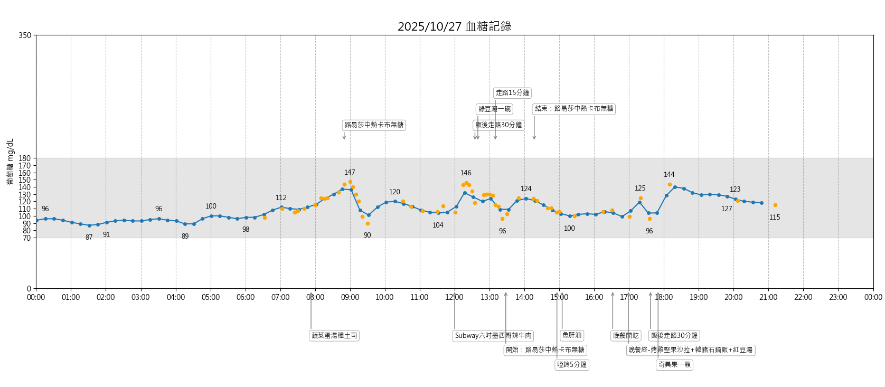
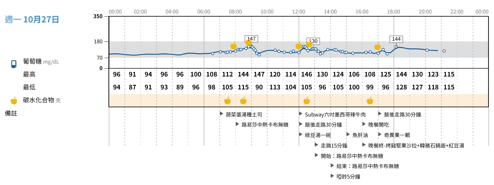

# LibreView 血糖數據視覺化工具

這是一個 Python 程式，用於讀取從 FreeStyle LibreView 網站匯出的血糖數據 CSV 檔案，並產生專業、易於閱讀的單日血糖模式統計圖。

> 備註：初版程式碼完全由 Gemini CLI 生成。在 [prompts](prompts) 資料夾底下有整理一些與 AI agent 互動過程的 prompts。

## 功能特色

* **血糖曲線繪製**：清晰呈現一天內的血糖波動趨勢。
* **目標範圍標示**：以灰色區域標示血糖的目標範圍 (70-180 mg/dL)。
* **關鍵點位標註**：自動標示每兩小時區間內的最高與最低血糖值。
* **智慧備註排版**：將 CSV 中的文字備註，根據血糖高低，智慧地排列在圖表上下方，並具備動態防重疊功能。
* **命令列操作**：可透過命令列參數指定輸入檔案與要分析的日期，方便整合與自動化。
* **跨平台中文字型**：自動偵測並套用系統中可用的中文字型，解決 `matplotlib` 的中文亂碼問題。

執行結果展示：



## 與官方網站的報表有何差異

官方網站 (libreview.com) 提供的血糖報表其實已經蠻豐富、美觀，其中包含了每月摘要、每日記錄、快照、餐食模式、每週摘要等多種檢視角度。只是，我覺得其中的「每日記錄」報表稍有美中不足之處：備註文字一律對齊整點時段區間的開頭，因而無法看出特定事件（如飲食、運動）所發生的時間。如下圖：



因此，我把上述需求整理成圖片和文字，並提供範例資料檔（.csv 檔案）讓 Gemini CLI 分析一下，看看能否生成 Python 程式來繪製單日血糖統計圖。於是這個程式就誕生了。

## 安裝說明

1. **複製專案**

    ```shell
    git clone https://github.com/huanlin/libreview-more.git
    cd libreview-more
    ```

2. **安裝必要的 Python 函式庫**

    ```shell
    pip install matplotlib
    ```

## 使用方法

將您從 LibreView 網站下載的 CSV 檔案放入 [data](data) 資料夾中。

然後，透過以下命令列指令來產生圖表：

```shell
python main.py -f [檔案路徑] -d [日期]
```

### 參數說明

* `-f`, `--file`: **(必填)** 指定輸入的 CSV 資料檔案路徑。
* `-d`, `--date`: **(必填)** 指定要統計的日期，格式為 `YYYY-MM-DD`。

### 命令範例

假設您的血糖資料檔案是 `data/glucose_2025-10-27.csv`，並且您想分析 `2025-10-27` 這一天的數據，請執行以下命令：

```shell
python main.py -f data/glucose_2025-10-27.csv -d 2025-10-27
```

程式執行後，將會跳出一個視窗，顯示繪製完成的血糖統計圖。

## 授權條款

本專案採用 [MIT License](LICENSE) 授權。
