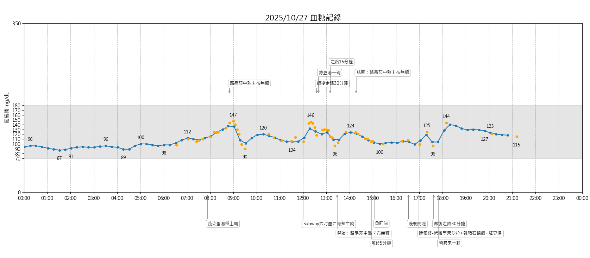

# 2025-10-27 血糖摘要

觀察：

- 早餐吃蔬菜吐司，然後一杯路易莎中杯卡布奇諾（無糖）。血糖是慢慢上升到最高 147。中午吃 subway 潛艇堡（六吋，墨西哥辣牛肉），血糖上升速度就快得多。一個潛艇堡大約十分鐘就吃完了。
- 飯後走路 30 分鐘有幫助！即使剛剛喝了一碗蠻甜的綠豆湯，血糖並未升高，而是持續下降。
- 下午也喝了一杯路易莎中杯卡布奇諾（無糖），但花了更長時間才喝完，期間血糖最高只到 124。
- 晚餐先吃一盒雞肉生菜沙拉，然後才吃韓式豬肉石鍋拌飯，最後喝了兩碗紅豆湯。吃進去的量不少，但是飯後一小時的血糖最多只到 125。這可能是因為先吃了一盒生菜沙拉的緣故，而且吃石鍋拌飯時的進食速度也有注意避免吃太快。

個人結論：

- 喝加奶的咖啡會升高血糖（畢竟牛奶有糖分）。
- 潛艇堡還是避免吧。
- 吃主餐前先吃沙拉比較好。
